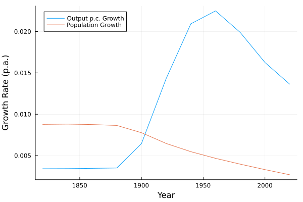
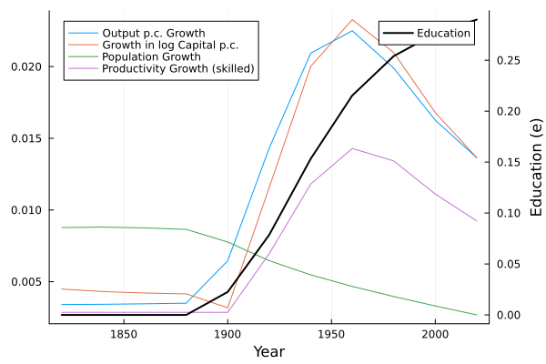
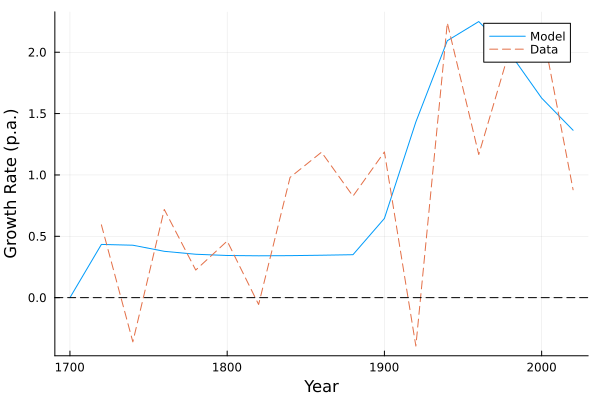
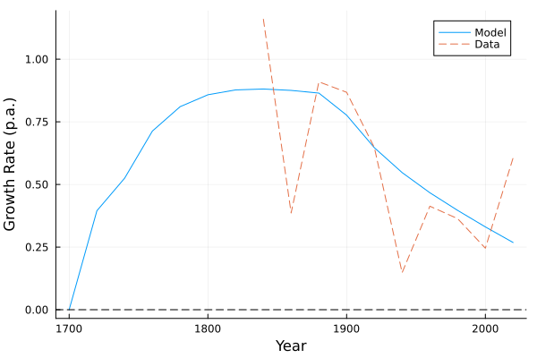
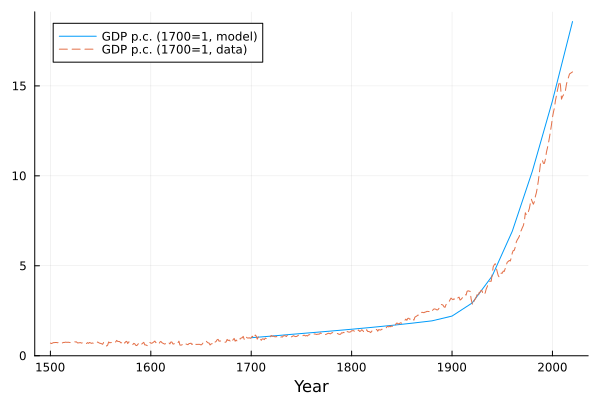
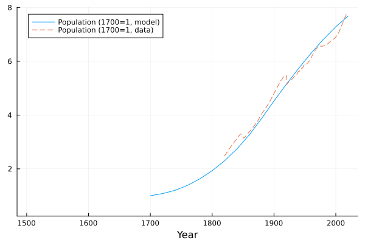
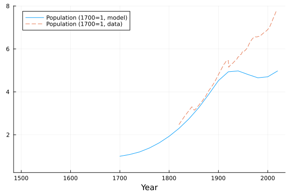
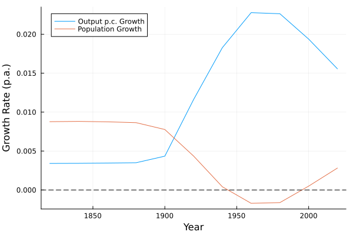
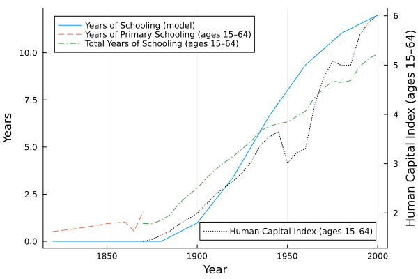
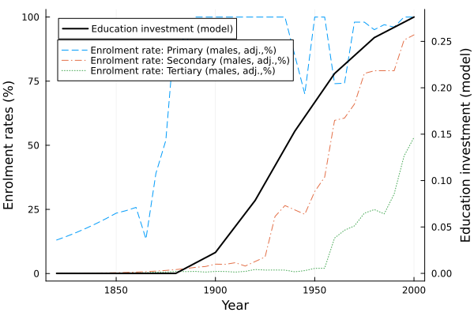

::: {.callout-note}

# Collegio Carlo Alberto Replication Project

This report was created as part of the assessment for the [`Computational Economics` Course](https://floswald.github.io/CompEcon/) in the PhD program at Collegio Carlo Alberto taught by Florian Oswald.

:::

## Paper and Replication Package

This report attempts a replication of:

- Cervellati, Matteo, Meyerheim, Georg, and Sunde, Uwe (2024),  
  *“The Empirics of Economic Growth over Time and across Nations: A Unified Growth Perspective”*

using the `Julia` programming language.

The original replication materials are implemented in Stata and R. This project implements the simulation and figure-generation pipeline in Julia.

I aimed to and succeed in replicating the following exhibits:

1. Figure 1 (Dynamics of State Variables)
2. Figure 2 (Income and Population Growth Rates - Simulated vs Actual)
3. Figure 3 (Income and Population - Simulated vs Actual)
4. Figure 4 (Income and Population - Alternative Scenario)
5. Figure 5 (Human Capital - Simulated vs Actual)

Overall, the replication is successful. Minor visual differences arise due to differences in plotting.

---

## Description of the Computational Problem in the Replication

The computational core of the project consists of simulating a nonlinear dynamic system that captures the joint evolution of productivity, education, human capital, and population. The goal of the replication is to reconstruct the transition dynamics generated by the model and verify that they reproduce the patterns shown in the original paper.

### 1. Human Capital Dynamics and Recursive Structure

The simulation is based on a recursive system of state variables, namely productivity, population, capital, and human capital. A key object is individual human capital $h_t$, determined by education:

$$
h_{t+1} = 1 + e_{t+1}
$$

Education $e_{t+1}$ is computed as a deterministic function of the economic environment, in particular skilled-sector productivity and wages:

$$
e_{t+1} = f(A^S_{t+1}, w^L_t)
$$

The recursive structure of the simulation is therefore:

$$
(A^S_t, A^U_t, h_t, L_t, K_t)
\;\rightarrow\;
e_{t+1}
\;\rightarrow\;
h_{t+1}, s_t, n_t
\;\rightarrow\;
(A^S_{t+1}, A^U_{t+1}, L_{t+1}, K_{t+1})
$$

Here:
- $s_t$ are savings
- $n_t$ is fertility
- $A_t^S$ is unskilled productivity
- $A_t^U$ is skilled productivity
- $L_t$ is unskilled labor
- $K_t$ is physical capital

This feedback mechanism drives the transition from stagnation to growth.

### 2. Procedure

1. Set initial conditions at pre-industrial levels for each country:
$$
h_1, \quad L_1, \quad N_1, \quad K_1, \quad A^S_1, \quad A^U_1
$$

2. Fix parameter values according to the calibration in the paper.

3. For each period t, compute sequentially:

- output and wages from production,
- next-period education:
- human capital:
- savings $s_t$,
- fertility $n_t$,
- next-period state variables:
$$
L_{2}, \quad N_{2}, \quad h_{2}, \quad K_{2}
$$
- productivity updates $A^S_{2}$ and $A^U_{2}$.

4. Iterate.

The simulation is implemented for 114 countries over multiple periods. However, for the baseline figures, the analysis focuses on the simulated path of England, which serves as the benchmark economy in the model.

---

# Replication

The Julia implementation successfully reproduces the qualitative patterns of all figures.

## Figure 1

**(a) Output per capita and population growth**

 Output per capita growth remains low until around 1900 and then increases sharply, while population growth declines over time.

**(b) Productivity, capital per capita and education**

Education remains at zero for a long period and then increases sharply during the transition, which is consistent with the theoretical mechanism. The rise in education coincides with increases in productivity and output growth, highlighting the model’s feedback structure.

---

## Figure 2

**(a) Output growth: model vs data**

The model matches the long-run trend in output growth reasonably well. In particular, it captures the acceleration after the Industrial Revolution. However, the empirical data display substantial short-run volatility, which is absent in the model.

**(b) Population growth: model vs data**

The model reproduces the general pattern of population decline. Nonetheless, the model generates a smoother trajectory and does not capture the sharp fluctuations observed in the data, especially around the transition period.

---

## Figure 3

**(a) Output per capita (levels)**

The model closely matches the long-run increase in output per capita.

**(b) Population (levels)**

The model closely matches the long-run increase in population.

---

## Figure 4

This figure is based on the modified version of the model in which both technologies are affected by inter-generetional spillovers.

**(a) Population (levels)**

Compared to the baseline, the model generates a sharper decline in fertility.

**(b) Population growth**

Fertility now falls even below replecement. 

---

## Figure 5

**(a) Education investment vs enrollment by level**

The model-generated education investment is consistent in magnitude and trend with the expansion of schooling.

**(b) Education investment and enrollment rates**

The model reproduces the timing of the education take-off. Empirical enrollment rates show steeper increases, particularly in the primary school, while the model produces a smoother transition.

---

## Images

The figures below compare the replicated figures produced by the Julia package. The replicated figures are saved in `replication_results/`.

::: {#fig-1 layout-ncol=2}

Figure 1: Dynamics of State Variables.

:::

::: {#fig-2 layout-ncol=2}

Figure 2: Income and Population Growth Rates - Simulated vs Actual.

:::

::: {#fig-3 layout-ncol=2}

Figure 3: Income and Population - Simulated vs Actual.

:::

::: {#fig-4 layout-ncol=2}

Figure 4: Income and Population - Alternative Scenario.

:::

::: {#fig-5 layout-ncol=2}

Figure 5: Human Capital - Simulated vs Actual.

:::

---

## Discussion

The replication confirms the main findings of the paper.

Remaining differences are minor and attributable to plotting of the outcome.

---

## Conclusion

This project demonstrates that the empirical framework of Cervellati et al. can be successfully replicated in Julia.

This result validate the original findings.

---

## Requirements

- Datasets used in the original analysis - .dta format

- No explicit hardware or time requirements specified.

---

## My Setup

- Machine: Windows laptop  
- CPU: 12th Gen Intel Core i7-1255U
- RAM: 16 GB
- OS: Windows 11  

Software used:

- Julia 1.12
- Main Packages:
  - DataFrames
  - CSV
  - ReadStatTables
  - Plots
  - Statistics
- Visual Studio Code 
- VSC Extensions:
  - Julia
  - Quarto
  - vscode-pdf

All computations run locally and complete within a few seconds.
